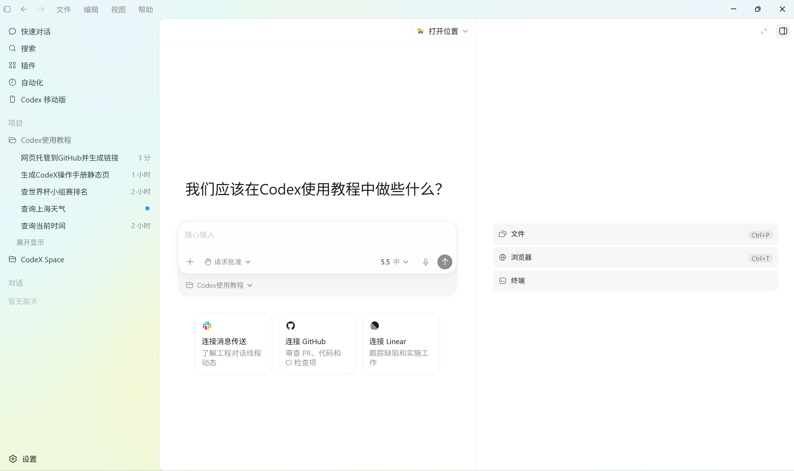

# CodeX/Codex 用户操作手册静态页

这是达芙妮内部使用的 CodeX/Codex 图文操作手册页面，面向非 IT 同事，覆盖账号准备、ChatGPT 注册与订阅、Codex 下载、入门使用和进阶使用。

## 文件结构

```text
.
├─ index.html                 # 页面结构与正文内容
├─ AGENTS.md                  # 项目维护约定
├─ assets/
│  ├─ css/styles.css          # 页面主题、布局、卡片和图片样式
│  ├─ js/main.js              # 导航高亮、返回顶部、图片新窗口打开等交互
│  └─ img/
│     ├─ brand/               # 品牌与 Codex logo
│     └─ screenshots/         # 页面中使用的截图或 SVG 示意图
├─ picture/                   # 原始图片素材，便于后续替换
└─ backups/                   # 历史备份
```

## 本地打开

直接双击 `index.html`，或在浏览器中打开：

```text
file:///D:/CodeX%20Space/Codex%E4%BD%BF%E7%94%A8%E6%95%99%E7%A8%8B/index.html
```

页面使用 Bootstrap CDN。断网时正文仍可阅读，但部分 Bootstrap 样式和图标可能降级。

## 维护说明

- 主题色在 `assets/css/styles.css` 的 `:root` 中维护，当前主色为 `#f0cacf`。
- 页面正文主要在 `index.html` 中维护。
- 截图优先放入 `picture/` 保存原始素材，再复制或引用到页面中。
- 页面内正文图片已支持点击后在新窗口打开，逻辑在 `assets/js/main.js`。
- `Codex 简介`内容已按 `AGENTS.md` 固定，后续不再改动。

## 替换图片

1. 将新图片放入 `picture/`。
2. 在 `index.html` 中找到对应 `` 的 `src`。
3. 将路径改为新图片路径，例如：

```html

```

常用图片类：

- `desktop-screenshot`：大尺寸桌面截图。
- `feature-inline-image`：卡片内说明图。
- `plan-image`：套餐截图。

## 内容口径

订阅、下载入口、套餐权益和可用能力变化较快，页面中只做内部学习说明，最终以公司 IT 通知及 OpenAI 官方页面为准。